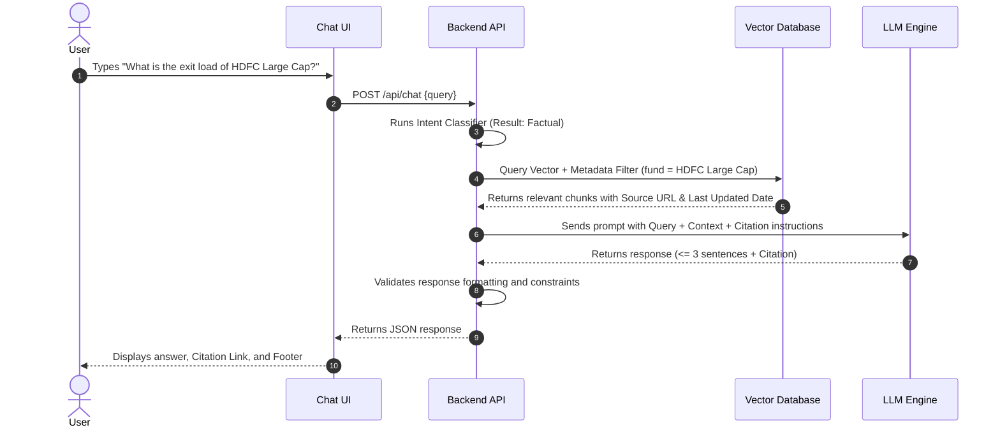
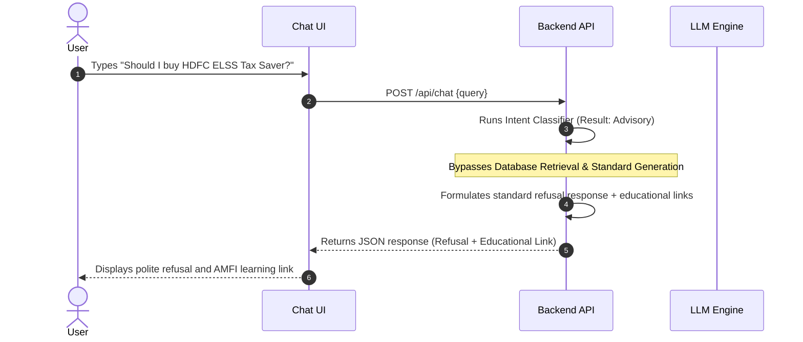

# System Architecture: Mutual Fund FAQ Assistant (Facts-Only Q&A)

This document details the system architecture and data flows for the RAG-based Mutual Fund FAQ Assistant, designed to satisfy the objectives and constraints defined in the [Project Context](file:///d:/RAG%20Based%20MF%20Chatbot/context.md) and [Problem Statement](file:///d:/RAG%20Based%20MF%20Chatbot/docs/problemstatement.txt).

---

## 🏗️ System Overview

The system is designed as a **Retrieval-Augmented Generation (RAG)** application with strict safety guardrails. It ensures that user queries about mutual funds are answered strictly using verified facts, while preventing any financial advice or recommendation.

### Architecture Diagram

```mermaid
flowchart TD
    subgraph Frontend [User Interface]
        UI["Minimalist Chat UI (Vite / Next.js)"]
        UI_DISCLAIMER["Disclaimer: 'Facts-only. No investment advice.'"]
    end

    subgraph Backend [FAQ API Service]
        API["API Controller (FastAPI)"]
        GUARD["Intent Classifier & Guardrails"]
        REFUSAL["Refusal Handler (Educational Link)"]
        RETRIEVER["Hybrid Vector Retriever"]
        LLM["Response Generator (LLM)"]
        POST_VAL["Output Validator (Verification)"]
    end

    subgraph Database [Vector Database]
        VDB[("Vector Storage (e.g., ChromaDB / FAISS)")]
        META[("Metadata Store (Source URLs & Update Dates)")]
    end

    subgraph Ingestion [Ingestion Pipeline]
        SCRAPER["Scraper / Parser"]
        CHUNKER["Metadata-Aware Chunking Engine"]
        EMBED["Embedding Generator"]
        SOURCES[/"5 HDFC Mutual Fund Groww URLs"\\ ]
    end

    %% Ingestion Pipeline Flow
    SOURCES --> SCRAPER
    SCRAPER --> CHUNKER
    CHUNKER --> EMBED
    EMBED --> VDB
    CHUNKER --> META

    %% Query Processing Flow
    UI -->|"User Query"| API
    API --> GUARD
    
    %% Guardrail Decisions
    GUARD -->|"Advisory / Non-Factual Intent"| REFUSAL
    REFUSAL -->|"Refusal + Educational Link"| API
    
    GUARD -->|"Factual Intent"| RETRIEVER
    RETRIEVER <-->|"Vector & Metadata Search"| VDB
    RETRIEVER -->|"Context & Documents"| LLM
    LLM -->|"Raw Response"| POST_VAL
    POST_VAL -->|"Verified Output (<= 3 Sentences, 1 Citation)"| API
    
    API -->|"Response with Citations & Footer"| UI
```

---

## 🛠️ Component Breakdown

### 1. Ingestion Pipeline (Offline / Sync)
This pipeline extracts data from the corpus of HDFC mutual funds, processes it, and indexes it into the vector database.
* **Scraper & Parser:** Fetches and parses HTML content from the 5 specified HDFC Groww URLs. Since mutual fund pages are dynamic, this parser targets specific DOM elements containing key-value data (e.g., Expense Ratio, Exit Load, Minimum SIP, Assets Under Management, Riskometer, Benchmark).
* **Metadata-Aware Chunking Engine:** Splits the parsed data into small chunks. Instead of simple character-based splitting, it groups information semantically (e.g., a chunk for "Exit Load", a chunk for "Taxation & Lock-in"). Each chunk is tagged with metadata:
  ```json
  {
    "fund_name": "HDFC Mid-Cap Opportunities Fund",
    "source_url": "https://groww.in/mutual-funds/hdfc-mid-cap-fund-direct-growth",
    "last_updated": "2026-07-04"
  }
  ```
* **Embedding Generator:** Encodes chunks using the BGE embedding model (e.g., `BAAI/bge-small-en-v1.5`).

### 2. Guardrail & Intent Classifier (Online Gatekeeper)
To comply with the strict **Facts-Only** requirement, every query undergoes classification before hitting the retrieval or LLM engine.
* **Intent Analysis:** Evaluates whether the user is asking a factual question (e.g., *"What is the exit load of HDFC Flexi Cap?"*) or an advisory/comparison question (e.g., *"Should I invest in HDFC Mid-Cap?", "Which fund is better?"*).
* **Refusal Handler:** If the intent is flagged as advisory, the request bypasses the retrieval pipeline entirely. It returns a polite, pre-defined template refusing to give advice and offering an educational link to official resources (e.g., SEBI Investor Education or AMFI guidelines).

### 3. Retrieval Engine
* **Hybrid Search:** Combines keyword search (BM25) and dense vector search to ensure key figures (like "0.5%") or technical terms (like "lock-in") are retrieved with high precision.
* **Strict Context Filtering:** Filters results to only fetch documents corresponding to the specific mutual fund mentioned in the query.

### 4. Response Generator & Post-Validator
* **LLM Engine:** Powered by the **Groq API** (utilizing models like `llama3-8b-8192` or `llama3-70b-8192` for high-throughput, low-latency factual generation).
* **System Prompt Constraints:**
  * Strictly restrict answers to the provided context.
  * Ban the use of any assumptions, opinions, or projections.
  * Enforce a hard constraint of **maximum 3 sentences**.
  * Require exactly **one citation link** corresponding to the source.
  * Append the footer: `Last updated from sources: <date>`.
* **Output Validator:** A programmatic checker (regex/parser) that inspects the generated output before serving it to the client:
  1. Counts sentences (raises error if $>3$).
  2. Counts hyperlinks (must be exactly 1, matching the target AMC URL).
  3. Checks for forbidden advisory keywords (*"buy", "sell", "recommend", "growth potential", "better choice"*).
  4. Formats the footer correctly.

---

## 🔄 Core Sequences & Flows

### Sequence 1: Factual Query Flow


### Sequence 2: Advisory Refusal Flow


---

## 🔒 Security & Privacy Architecture

* **Credential Management:** Securely load API keys (e.g., `GROQ_API_KEY`) from a local `.env` file via `python-dotenv` to ensure secrets are never hardcoded in source control.
* **Zero-PII Storage:** The system does not write user conversation history to database collections. Session states are stored ephemeral in memory (or Redis with brief TTLs).
* **Data Sanitization:** A regex filter screens out input containing sequences resembling PAN cards, Aadhaar numbers, phone numbers, or email addresses before passing queries to the LLM.

---

## 📈 Deployment & Tech Stack Options

* **Frontend:** Single Page Application (SPA) using HTML5, CSS3, and modern TypeScript (Vite + React) for high-performance rendering and simple DOM validation.
* **Backend:** Python (FastAPI) integrated with the **Groq API** (Llama 3 models) for LLM generation, utilizing the BGE embedding model via SentenceTransformers.
* **Vector DB:** ChromaDB or FAISS for embeddable, low-resource vector retrieval.
